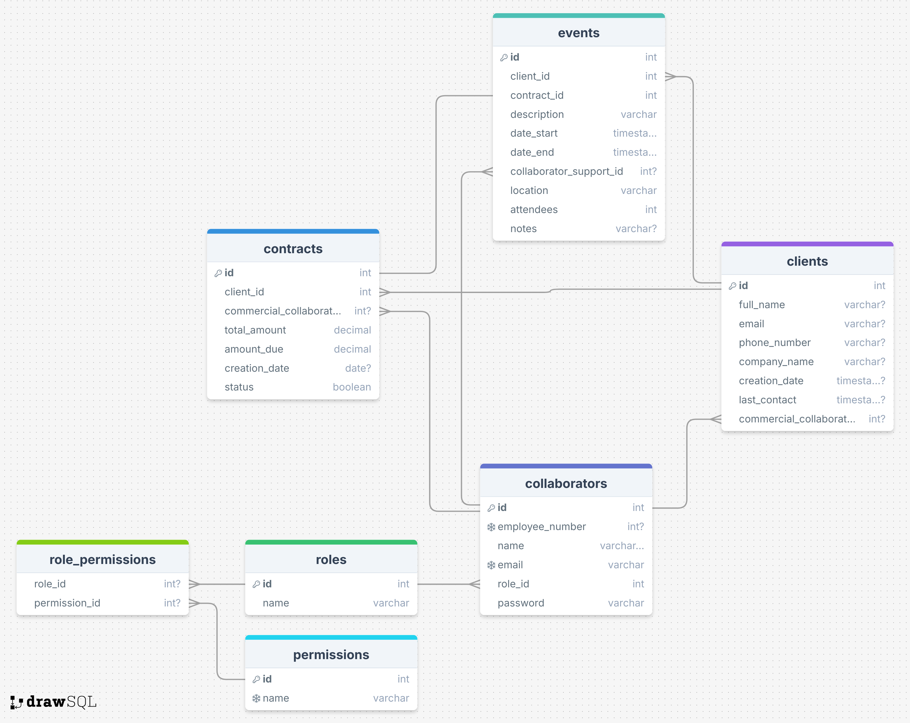

# Epic Events CLI

## Table of Contents
- [Project Overview](#project-overview)
- [Features](#features)
- [Technologies Used](#technologies-used)
- [Installation](#installation)
- [Usage](#usage)
- [Commands](#commands)
- [Database Setup and Migrations](#database-setup-and-migrations)
- [Testing](#testing)
- [Contributing](#contributing)
- [License](#license)
- [Contact](#contact)
- [Schema db](#schema-db)

## Project Overview
Epic Events is a command-line interface (CLI) application designed to manage clients, contracts, and events efficiently. The application is built using Python, with Click for the CLI, SQLAlchemy for ORM, and Alembic for managing database migrations. This tool is ideal for users who need to interact with their event management system directly from the terminal.

## Features
- Client Management: Create, update, list, and delete clients.
- Contract Management: Manage contracts associated with clients and events.
- Event Management: Organize and schedule events efficiently.
- User Authentication: Secure login and role-based access control.
- Command-Line Interface: Intuitive commands to interact with the application.

## Technologies Used
- Programming Language: Python
- CLI Framework: Click
- Database: PostgreSQL
- ORM: SQLAlchemy
- Migrations: Alembic
- Testing: pytest

## Installation
To install and set up the Epic Events CLI application on your local machine, follow these steps:

1. Clone the repository:
    ```bash
    git clone https://github.com/br-imen/epic_events.git
    cd epic_events
    ```

2. Set up a virtual environment:

    ```bash
    python3 -m venv venv
    source venv/bin/activate  # On Windows, use `env\Scripts\activate`
    ```

3. Install dependencies:

    ```bash
    pip install -r requirements.txt
    ```

4. Set up the database:
    create your database and ensure your .env file is correctly configured to connect to the database
    ```bash
    DATABASE_URL= "your_database_url"
    ```

    you need to run the command to initialize the database with the tables and roles-permissions.
    ```bash
    python scripts/init_db.py
    ```
    There is a superuser that allows you to create the first collaborator. 
    The superuser credentials are provided separately as secrets to be placed in the .env file:

            SUPER_USER
            SUPER_USER_PASSWORD
            SUPER_USER_EMAIL

5. Ensure that the .env file has all these env variables:
    ```bash
    # Sentry DSN (Data Source Name) for error tracking.
    SENTRY_DSN = ""

    # Database connection URL.
    DATABASE_URL= ""

    # Database username.
    DB_USER = ""

    # Database password.
    DB_PASSWORD = ""

    # Database name.
    DB_NAME = ""

    # Default database type.
    DEFAULT_DB = ""

    # Superuser username.
    SUPER_USER = ""

    # Superuser password.
    SUPER_USER_PASSWORD = ""

    # Superuser email address.
    SUPER_USER_EMAIL = ""

    # Secret key for encryption.
    SECRET_KEY = ""

    # Algorithm used for token encryption.
    ALGORITHM = ""

    # Expiration time for access tokens in minutes.
    ACCESS_TOKEN_EXPIRE_MINUTES = 

    TOKEN_DIR_PATH = ""
    TOKEN_FILENAME = ""
    ```

6. Run the CLI application:

    ```bash
    python epic_events.py
    ```

## Usage
Epic Events CLI allows you to manage event-related data via simple commands. All operations, including client, contract, and event management, are performed through the CLI.

To see the list of available commands, simply run:

```bash
python epic_events.py --help
```

## Commands
Below is a list of the primary commands available in the Epic Events CLI:

- Client Commands:

        add-client: Add a new client.
        update-client: Update existing client information.
        list-clients: List all clients.
        delete-client: Delete a client.

- Contract Commands:

        add-contract: Create a new contract.
        update-contract: Update an existing contract.
        list-contracts: List all contracts.
        delete-contract: Delete a contract.

- Event Commands:

        add-event: Schedule a new event.
        update-event: Update event details.
        list-events: List all events.
        delete-event: Delete an event.

- Authentication Commands:

        login: Log in to the system with your credentials.
        logout


## Testing
The project includes tests to ensure that the CLI functions as expected. To run the tests, use the following command:

```bash
pytest
```
Make sure your virtual environment is activated and that all dependencies are installed before running the tests. 

## Code coverage
```bash
pytest --cov
```

## Schema

